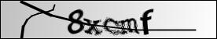
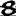
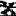
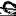
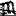
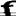

# neural-captcha

### Description
This is a synapticjs implementation of the neural network designed to crack one particular type of captchas.

### Knowledge database format
Knowledge database must be properly formatted according to this template:
```
[
  {
    letter: "a",
    pixels: [1,0,1,0,0,1,...]
  },
  {
    letter: "b",
    pixels: [1,1,0,0,0,1,...]
  },  
  ...
]
```
Property **letter** should be a string with only one character and property **pixels** should be an array of 256 numbers.

### Prerequisites
1. `npm install -g browserify`
2. `npm install -g uglify-js`

### How to setup
1. `git clone https://github.com/stjepangolemac/neural-captcha.git`
2. `npm install`
3. put knowledge database to db/ directory and name it db.json

### How to use
1. Run `npm run build` and browser bundle will be generated in the gen/ directory with a name `neural-captcha-bundle.js`
3. Copy and import that bundle into your html document: `<script src="neural-captcha-bundle.js"></script>`
4. Call `neural()` and pass the pixels of the letter you want it to recognize: `console.log(neural([0,0,0,1,1,...])`
5. The result is an array of all letters along with their chances

### About database creation
The database is not provided here but here are couple of directions for creating your own. Firstly, this neural network works with 16x16 images and therefore has 256 input neurons. Each character is isolated, cropped and scaled to that size. It is tested and works really well with black and white images but it should work with grayscale pixels too (it should probably be trained with grayscale images then). The database I used for training had approximately 10.5k properly recognized lowercase characters (processed by humans and neural network). Code can easily be modified to accept uppercase letters and (some?) special characters.

This is the type of captcha this network is trained to crack.



And this are the isolated characters.





